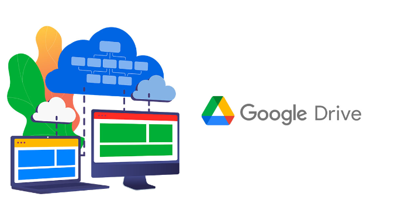
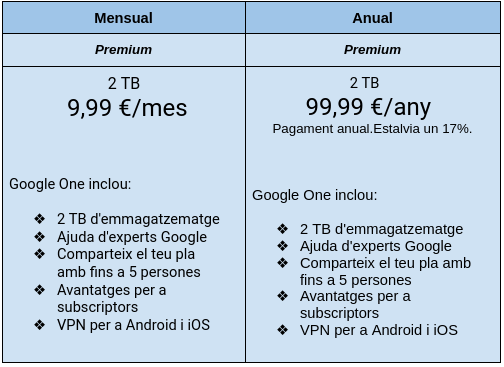
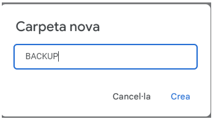
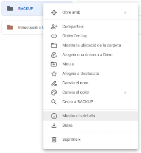

# Guia de creació de les unitats compartides BACKUP i DOCUMENTS
# Cas Pràctic 1: Oficina online

## Índex	
* Perquè pensem que és una bona solució	
* Pressupost mensual i anual	
* Guía de creació de l’usuari i administrador	
* Creació accés directe de la carpetes “BACKUP” i “DOCUMENTS”a l’escriptori dels usuaris i Administrador i com accedir a aquest	
* Exemples d’ús de fer un backup per part de l’administrador/a	

### Perquè pensem que és una bona solució

Pensem que aquesta és una bona solució perquè normalment a les còpies de seguretat hi ha informació molt important, i si les guardem a un disc dur, si aquest es malmet o es perd podem perdre la informació que aquest conté.
En canvi si utilitzem google drive, al poder-ho guardar al núvol és molt més segur i fiable i podem accedir a aquest des de qualsevol equip.

### Pressupost mensual i anual

- Hi han dos tipus de pla per compra les 2 TB que necessitem, un és mensual i l’altre es anual. Aquesta és la diferència entre elles. La diferencia entre aquests dos plans es que t’estalvies uns 19,98€ anuals.

### Guía de creació de l’usuari i administrador

Administrador: Roberto(rpohrib@iesebre.com)
Usuari: Narcís(nlleixa@iesebre.com)

Primer crearem una carpeta que és digue BACKUP i que només tindrà acces el administrador.

Per a que aquesta carpeta només pot tindre accés el administrador, haurem de fer clic dret a la carpeta i després ens dirigim a “Mostra els detalls”. Una vegada dins fiquem el correu del administrador per a que només ell tingui accés.

En el meu cas com que sóc el administrador que crear la carpeta no cal ficar la persona que té accés a la carpeta.
Ara tocar crear la carpeta de DOCUMENTS que tindrà accés d’editar el administrador i accés de lectura el usuari.

Ara ens tocar posar els permisos a la carpeta, en aquest cas el usuari tindrà el acces de lectura i el admin d’editar.

